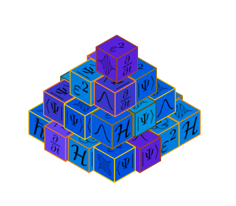

Welcome to WaveBlocksND's documentation!
========================================

Reusable building blocks for simulations with semiclassical wavepackets for
solving the time-dependent Schrödinger equation.

User Manual
===========

Please note that some sections of the manual are still outdated.
The source code documentation below is actually up to date.

.. toctree::
   :maxdepth: 2

   manual/first_glance
   manual/performing_simulations.rst
   manual/the_core.rst
   manual/interactive_use.rst
   manual/extending_waveblocks.rst
   citation

Potential Library
=================

.. toctree::
   :maxdepth: 1

   potlib/potentials.rst

Source code documentation
=========================

WaveBlocks Classes
-------------------

Basic numerics
^^^^^^^^^^^^^^

.. toctree::
   :maxdepth: 1

   waveblocks_classes/ComplexMath

   waveblocks_classes/Grid
   waveblocks_classes/DenseGrid
   waveblocks_classes/TensorProductGrid
   waveblocks_classes/GridWrapper

   waveblocks_classes/QuadratureRule
   waveblocks_classes/TrapezoidalQR
   waveblocks_classes/GaussHermiteOriginalQR
   waveblocks_classes/GaussHermiteQR
   waveblocks_classes/GaussLaguerreQR
   waveblocks_classes/TensorProductQR
   waveblocks_classes/SmolyakQR
   waveblocks_classes/GenzKeisterOriginalQR
   waveblocks_classes/GenzKeisterQR

   waveblocks_classes/MatrixExponential

   waveblocks_classes/Utils

   waveblocks_classes/PhaseSpaceLattice

Basic quantum mechanics
^^^^^^^^^^^^^^^^^^^^^^^

.. toctree::
   :maxdepth: 1

   waveblocks_classes/WaveFunction

   waveblocks_classes/MatrixPotential
   waveblocks_classes/MatrixPotential1S
   waveblocks_classes/MatrixPotential2S
   waveblocks_classes/MatrixPotentialMS

Wavepackets
^^^^^^^^^^^

.. toctree::
   :maxdepth: 1

   waveblocks_classes/BasisShape
   waveblocks_classes/HyperCubicShape
   waveblocks_classes/SimplexShape
   waveblocks_classes/HyperbolicCutShape
   waveblocks_classes/LimitedHyperbolicCutShape

   waveblocks_classes/Wavepacket
   waveblocks_classes/HagedornWavepacketBase
   waveblocks_classes/HagedornWavepacket
   waveblocks_classes/HagedornWavepacketInhomogeneous

   waveblocks_classes/Gradient
   waveblocks_classes/GradientHAWP

   waveblocks_classes/BasisTransformation
   waveblocks_classes/BasisTransformationWF
   waveblocks_classes/BasisTransformationHAWP

   waveblocks_classes/LinearCombinationOfWavepackets
   waveblocks_classes/LinearCombinationOfWPs
   waveblocks_classes/LinearCombinationOfHAWPs

   waveblocks_classes/GradientLCWP
   waveblocks_classes/GradientLinearCombinationHAWP

Inner Products
^^^^^^^^^^^^^^

.. toctree::
   :maxdepth: 1

   waveblocks_classes/InnerProduct

   waveblocks_classes/HomogeneousInnerProduct
   waveblocks_classes/InhomogeneousInnerProduct

   waveblocks_classes/HomogeneousInnerProductLCWP
   waveblocks_classes/InhomogeneousInnerProductLCWP

   waveblocks_classes/Quadrature

   waveblocks_classes/DirectQuadrature
   waveblocks_classes/DirectHomogeneousQuadrature
   waveblocks_classes/DirectInhomogeneousQuadrature

   waveblocks_classes/GaussianIntegral
   waveblocks_classes/SymbolicIntegral0
   waveblocks_classes/SymbolicIntegral
   waveblocks_classes/NSDInhomogeneous

   waveblocks_classes/SparsityOracle.rst
   waveblocks_classes/SparsityOracleTrue.rst
   waveblocks_classes/SparsityOraclePSHAWP.rst
   waveblocks_classes/SparsityOracleGIHAWP.rst

Observables
^^^^^^^^^^^

.. toctree::
   :maxdepth: 1

   waveblocks_classes/Observables
   waveblocks_classes/ObservablesHAWP
   waveblocks_classes/ObservablesMixedHAWP
   waveblocks_classes/ObservablesLCWP

Time propagation
^^^^^^^^^^^^^^^^

.. toctree::
   :maxdepth: 1

   waveblocks_classes/KineticOperator

   waveblocks_classes/SplittingParameters
   waveblocks_classes/PerturbedSplittingParameters
   waveblocks_classes/ProcessingSplittingParameters

   waveblocks_classes/Propagator
   waveblocks_classes/FourierPropagator
   waveblocks_classes/HagedornPropagator
   waveblocks_classes/HagedornPropagatorInhomogeneous
   waveblocks_classes/MagnusPropagator
   waveblocks_classes/SemiclassicalPropagator

   waveblocks_classes/SimulationLoop
   waveblocks_classes/SimulationLoopFourier
   waveblocks_classes/SimulationLoopHagedorn
   waveblocks_classes/SimulationLoopHagedornInhomogeneous

Simulation result storage I/O
^^^^^^^^^^^^^^^^^^^^^^^^^^^^^
.. toctree::
   :maxdepth: 1

   waveblocks_classes/IOManager

   waveblocks_classes/IOM_plugin_parameters
   waveblocks_classes/IOM_plugin_grid
   waveblocks_classes/IOM_plugin_wavefunction
   waveblocks_classes/IOM_plugin_fourieroperators
   waveblocks_classes/IOM_plugin_wavepacket
   waveblocks_classes/IOM_plugin_inhomogwavepacket
   waveblocks_classes/IOM_plugin_lincombwp
   waveblocks_classes/IOM_plugin_lincombhawp
   waveblocks_classes/IOM_plugin_overlaplcwp
   waveblocks_classes/IOM_plugin_norm
   waveblocks_classes/IOM_plugin_energy

Other classes and functions
^^^^^^^^^^^^^^^^^^^^^^^^^^^

.. toctree::
   :maxdepth: 1

   waveblocks_classes/GlobalDefaults
   waveblocks_classes/ParameterLoader
   waveblocks_classes/ParameterProvider
   waveblocks_classes/TimeManager
   waveblocks_classes/FileTools

   waveblocks_classes/BlockFactory

Plot
^^^^

.. toctree::
   :maxdepth: 1

   waveblocks_classes/plot/plot
   waveblocks_classes/plot3d/plot3d

Etc
===

.. toctree::
   :maxdepth: 2

   citation

Indices and tables
==================

* :ref:`genindex`
* :ref:`search`
