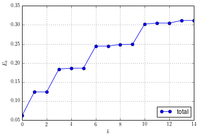

Computing Eigenstates
---------------------

In this section we show how to compute eigenstates on the
example of the Henon-Heiles potential. This two-dimensional
potential in the variables :math:`x` and :math:`y` is given by:

.. math::

   V(x) = \frac{a}{2} \left(x^{2} + y^{2}\right) + b \left(x^{2} y - \frac{y^{3}}{3}\right)

where we set :math:`a = 1` and  :math:`b = 1/2`. To compute the
eigenstates we write a configuration file ``eigenstates.py`` like:

::

    dimension = 2
    ncomponents = 1

    potential = "henon_heiles"

    eigenstate_of_level = 0

    eigenstates_indices = [0, 1, 2, 3, 4, 5, 6, 7, 8, 9, 10, 11, 12, 13, 14]

    starting_point = [0.5, 0.5]

    eps = 0.25

    hawp_template = {
        "type" : "HagedornWavepacket",
        "dimension" : dimension,
        "ncomponents": 1,
        "eps" : eps,
        "basis_shapes" : [{
                "type" : "HyperbolicCutShape",
                "K" : 24,
                "dimension" : dimension
                }]
        }

    innerproduct = {
        "type" : "HomogeneousInnerProduct",
        "delegate" : {
            "type" : "DirectHomogeneousQuadrature",
            'qr': {
                'type': 'TensorProductQR',
                'dimension': dimension,
                'qr_rules': [{'dimension': 1, 'order': 32, 'type': 'GaussHermiteQR'},
                             {'dimension': 1, 'order': 32, 'type': 'GaussHermiteQR'}]
            }
        }
    }

We compute the first 15 eigenstates :math:`\Psi_0` up to :math:`\Psi_{14}`.
The parameter ``starting_point`` sets the starting value for the minimization
of the potential surface. This value is choosen such to stay in the local minimum
we are interested in. The basis consists of the space spanned by all wavepackets
indexed in the hyperbolic cut having sparsity :math:`K=24`. The actual computation
is done by using the script ``ComputeEigenstates.py``::

    python ComputeEigenstates.py eigenstates.py

and will print some output::

    Using configuration from file: eigenstates.py
    Requested function: add_parameters
    Plugin to load: IOM_plugin_parameters
    Optimization terminated successfully.
             Current function value: 0.000000
             Iterations: 98
             Function evaluations: 189
    ----------------------------------------------------------------------
    Parameter values are:
    ---------------------
     q0:
    [[  2.24608505e-13]
     [  3.33457394e-13]]
     p0:
    [[ 0.]
     [ 0.]]
     Q0:
    [[  1.00000000e+00+0.j  -5.62327962e-14-0.j]
     [ -5.62883073e-14+0.j   1.00000000e+00+0.j]]
     P0:
    [[ 0. +1.00000000e+00j  0. +5.62327962e-14j]
     [ 0. +5.62883073e-14j  0. +1.00000000e+00j]]
     Consistency check:
       P^T Q - Q^T P  =?=  0
    [[ 0. +0.00000000e+00j  0. +1.11022302e-16j]
     [ 0. -1.11022302e-16j  0. +0.00000000e+00j]]
       Q^H P - P^H Q  =?=  2i
    [[ 0. +2.00000000e+00j  0. +1.26217745e-29j]
     [ 0. +1.26217745e-29j  0. +2.00000000e+00j]]
    Warning: no inner product specified!
    ----------------------------------------------------------------------
    State: 0
    Energy: 0.0623898880123
    Coefficients:

    [  9.99697146e-01+0.j   7.06667357e-09+0.j   1.88119658e-03+0.j
       1.22024364e-02+0.j   8.31557109e-04+0.j   1.61933847e-04+0.j
       3.51763774e-04+0.j   6.28914248e-05+0.j   1.48819058e-05+0.j
       1.53830363e-05+0.j   4.64872426e-06+0.j   1.40044195e-06+0.j
       9.48658758e-07+0.j   3.83630231e-07+0.j   1.42241989e-07+0.j
       7.84302527e-08+0.j   3.66375058e-08+0.j   1.58225631e-08+0.j
    ...

and produce an `eigenstates.hdf5` file containing all the wavepackets computed.
Next we compute norms and energies of these states by::

    python ComputeNorms.py -d eigenstates.hdf5
    python ComputeEnergies.py -d eigenstates.hdf5

We could also evaluate and plot the packets or call any other
post-processing script. But we like to do some custom computations
and therefore switch to an interactive python session now::

    BF = BlockFactory()
    IOM = IOManager()

    IOM.open_file("eigenstates.hdf5")
    PA = IOM.load_parameters()

    V = BF.create_potential(PA)

Load the wavepackets::

    packets = [IOM.load_wavepacket(0, blockid=i) for i in xrange(15)]

Set up a grid for evaluation::

    x = linspace(-2, 2, 500)
    y = linspace(-2, 2, 500)
    X, Y = meshgrid(x, y)
    M = row_stack([X.reshape(1,-1), Y.reshape(1,-1)])

and evaluate potential as well as eigenstates on this grid::

    v = V.evaluate_at(M, entry=(0,0)).reshape(500,500).T

    psis = [hawp.evaluate_at(M, prefactor=True, component=0).reshape(500,500) for hawp in packets]

Plot the eigenstates together with the potential contour lines::

    figure(figsize=(18,30))

    for i, psi in enumerate(psis):

        subplot(5, 3, i+1)
        plotcf2d(x, y, psi, darken=0.1)
        contour(x, y, v, linspace(0.05, 1.5, 10), colors="gray")
        title(r"$\psi_{%d}$" % i)

    savefig("henon_heiles_eigenstates.png")

.. image:: henon_heiles_eigenstates.png

We check that the eigenstates are properly normalized::

    N = [IOM.load_norm(blockid=i) for i in xrange(15)]
    N

::

    [array([[ 1.]]),
     array([[ 1.]]),
     array([[ 1.]]),
     array([[ 1.]]),
     array([[ 1.]]),
     array([[ 1.]]),
     array([[ 1.]]),
     array([[ 1.]]),
     array([[ 1.]]),
     array([[ 1.]]),
     array([[ 1.]]),
     array([[ 1.]]),
     array([[ 1.]]),
     array([[ 1.]]),
     array([[ 1.]])]

Finally, look at the energies of these states::

    E = squeeze(array([IOM.load_energy(blockid=i) for i in xrange(15)]))

::

    array([[ 0.03113906,  0.03125083],
           [ 0.06171018,  0.06251042],
           [ 0.06171017,  0.06251044],
           [ 0.09028264,  0.09378443],
           [ 0.09254484,  0.09379187],
           [ 0.09254101,  0.0937974 ],
           [ 0.11912411,  0.12505747],
           [ 0.11914656,  0.12503636],
           [ 0.12341898,  0.12514402],
           [ 0.12387966,  0.12501247],
           [ 0.14693627,  0.15548814],
           [ 0.14879932,  0.15576321],
           [ 0.14824844,  0.15631414],
           [ 0.15502718,  0.156359  ],
           [ 0.15527243,  0.15615653]])

and then plot the energy levels::

    figure()
    plot(arange(15), E[:,0], "-o", label=r"kinetic")
    plot(arange(15), E[:,1], "-o", label=r"potential")
    grid(True)
    legend(loc="lower right")
    xlabel(r"$k$")
    ylabel(r"$E_k$")

.. image:: henon_heiles_energy_levels.png

We can also easily compute the total energy::

    Etot = sum(E, axis=1)

::

    array([ 0.06238989,  0.12422061,  0.12422061,  0.18406707,  0.18633672,
            0.18633841,  0.24418158,  0.24418292,  0.248563  ,  0.24889214,
            0.3024244 ,  0.30456252,  0.30456258,  0.31138619,  0.31142895])

and again plot the energy levels based on these data::

    figure()
    plot(arange(15), Etot, "-o", label=r"total")
    grid(True)
    xlabel(r"$k$")
    ylabel(r"$E_k$")
    legend(loc="lower right")

