The Core and User scripts
=========================

The big picture
---------------

The ``WaveBlocks`` project is split into two parts. The first part (and this is called
``WaveBlocks`` too) is nothing else than a library or python package which collects
code modules that are general enough to be useful in many different applications
and simulation contexts. The second part consists of several scripts that use
code from the ``WaveBlocks`` package via python's ``import`` statement and perform
simulations, do data evaluation, plotting and much more. Some of these scripts
are fairly general (for example the one responsible for plotting energies) while
others originated from a single very specific research question ...

In the Core
-----------

In this section we describe the important parts of the ``WaveBlocks`` package from
a user point of view. (For the developers point of view, see Chapter ?)

Ready made Potentials
---------------------

The following sections contain some potentials that are implemented in the potential
library. The plots show the eigenvalues or energy surfaces. Some potentials
have additional parameters, the default values for these are also Name.

Potential ``cos_osc``
^^^^^^^^^^^^^^^^^^^^^^

* Formula: :math:`V(x) = a \left(- \cos{\left (b x \right )} + 1\right)`

* Default values:

  * :math:`a = 0.07`
  * :math:`b = 1.0`

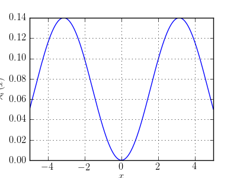

Potential ``cosh_osc``
^^^^^^^^^^^^^^^^^^^^^^^

* Formula: :math:`V(x) = a \cosh{\left (b x \right )}`

* Default values:

  * :math:`a = 1`
  * :math:`b = 1`

.. image:: fig/cosh_osc.png

Potential ``delta_gap``
^^^^^^^^^^^^^^^^^^^^^^^^

* Formula: :math:`V(x) = \left[\begin{smallmatrix}\frac{1}{2} \tanh{\left (x \right )} & \delta\\\delta & - \frac{1}{2} \tanh{\left (x \right )}\end{smallmatrix}\right]`

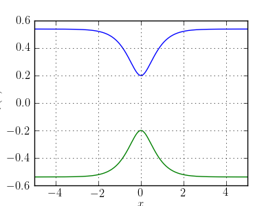

Potential ``delta_gap_diag``
^^^^^^^^^^^^^^^^^^^^^^^^^^^^^

* Formula: :math:`V(x) = \left[\begin{smallmatrix}\sqrt{\delta^{2} + \frac{1}{4} \tanh^{2}{\left (x \right )}} & 0\\0 & - \sqrt{\delta^{2} + \frac{1}{4} \tanh^{2}{\left (x \right )}}\end{smallmatrix}\right]`

.. image:: fig/delta_gap_diag.png

Potential ``double_well``
^^^^^^^^^^^^^^^^^^^^^^^^^^

* Formula: :math:`V(x) = \sigma \left(x^{2} -1\right)^{2}`

* Default values:

  * :math:`\sigma = 1.0`

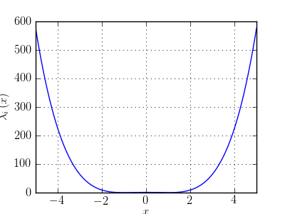

Potential ``eckart``
^^^^^^^^^^^^^^^^^^^^^

* Formula: :math:`V(x) = \frac{\sigma}{\cosh^{2}{\left (\frac{x}{a} \right )}}`

* Default values:

  * :math:`a = 0.944858082316`
  * :math:`\sigma = 0.038088`

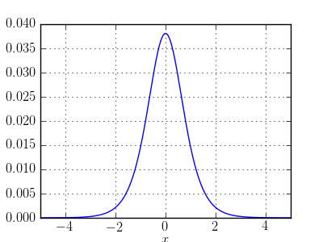

Potential ``five_quadratic``
^^^^^^^^^^^^^^^^^^^^^^^^^^^^^

* Formula: :math:`V(x) = \left[\begin{smallmatrix}\frac{1}{2} \sigma x^{2} & 0 & 0 & 0 & 0\\0 & \frac{1}{2} \sigma x^{2} & 0 & 0 & 0\\0 & 0 & \frac{1}{2} \sigma x^{2} & 0 & 0\\0 & 0 & 0 & \frac{1}{2} \sigma x^{2} & 0\\0 & 0 & 0 & 0 & \frac{1}{2} \sigma x^{2}\end{smallmatrix}\right]`

* Default values:

  * :math:`\sigma = 0.05`

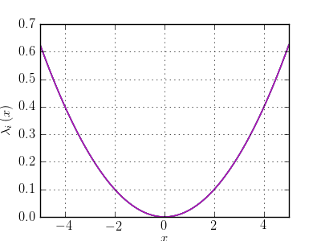

Potential ``four_powers``
^^^^^^^^^^^^^^^^^^^^^^^^^^

* Formula: :math:`V(x) = \left[\begin{smallmatrix}\frac{1}{2} \sigma x^{2} & 0 & 0 & 0\\0 & \frac{1}{4} \sigma x^{4} & 0 & 0\\0 & 0 & \frac{1}{6} \sigma x^{6} & 0\\0 & 0 & 0 & \frac{1}{8} \sigma x^{8}\end{smallmatrix}\right]`

* Default values:

  * :math:`\sigma = 0.05`

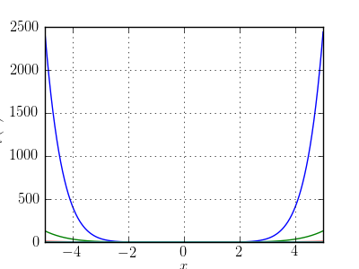

Potential ``four_quadratic``
^^^^^^^^^^^^^^^^^^^^^^^^^^^^^

* Formula: :math:`V(x) = \left[\begin{smallmatrix}\frac{1}{2} \sigma x^{2} & 0 & 0 & 0\\0 & \frac{1}{2} \sigma x^{2} & 0 & 0\\0 & 0 & \frac{1}{2} \sigma x^{2} & 0\\0 & 0 & 0 & \frac{1}{2} \sigma x^{2}\end{smallmatrix}\right]`

* Default values:

  * :math:`\sigma = 0.05`

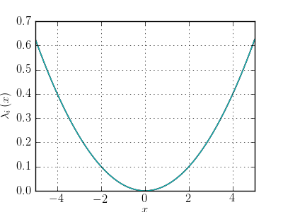

Potential ``free_particle``
^^^^^^^^^^^^^^^^^^^^^^^^^^^^

* Formula: :math:`V(x) = c`

* Default values:

  * :math:`c = 0`

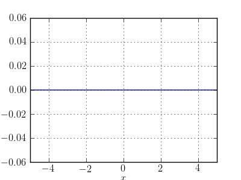

Potential ``morse``
^^^^^^^^^^^^^^^^^^^^

* Formula: :math:`V(x) = D \left(1 - e^{- a \left(x - x_{0}\right)}\right)^{2}`

* Default values:

  * :math:`a = 0.3`
  * :math:`x_{0} = 0.0`
  * :math:`D = 3.0`

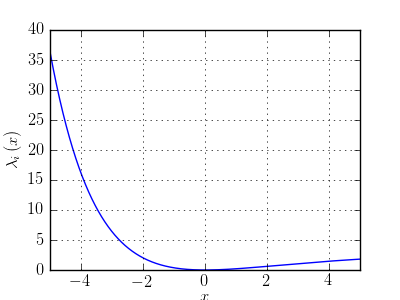

Potential ``morse_zero``
^^^^^^^^^^^^^^^^^^^^^^^^^

* Formula: :math:`V(x) = l^{2} \left(e^{- 2 x + 2 x_{0}} - 2 e^{- x + x_{0}}\right)`

* Default values:

  * :math:`x_{0} = 0.0`
  * :math:`l = 1.0`

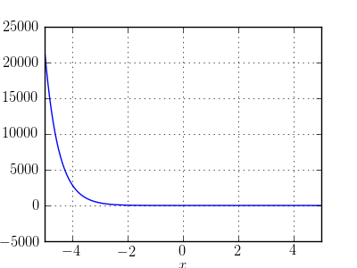

Potential ``pert_quadratic``
^^^^^^^^^^^^^^^^^^^^^^^^^^^^^

* Formula: :math:`V(x) = \frac{1}{2} \delta^{2} x^{2} + \frac{1}{2} \sigma x^{2}`

* Default values:

  * :math:`\sigma = 0.05`
  * :math:`\delta = 0.2`

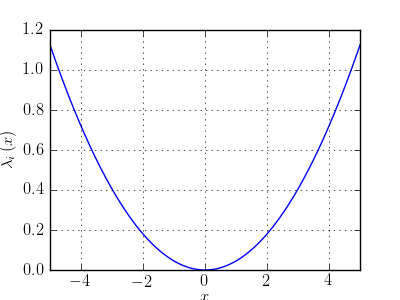

Potential ``quadratic``
^^^^^^^^^^^^^^^^^^^^^^^^

* Formula: :math:`V(x) = \frac{1}{2} \sigma x^{2}`

* Default values:

  * :math:`\sigma = 1/2`

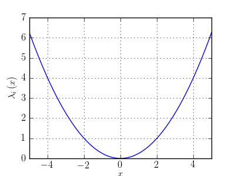

Potential ``quartic``
^^^^^^^^^^^^^^^^^^^^^^

* Formula: :math:`V(x) = \frac{1}{4} \sigma x^{4}`

* Default values:

  * :math:`\sigma = 0.05`

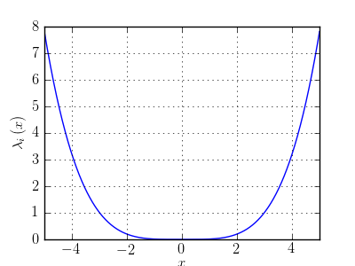

Potential ``three_levels``
^^^^^^^^^^^^^^^^^^^^^^^^^^^

* Formula: :math:`V(x) = \left[\begin{smallmatrix}\tanh{\left (- \rho + x \right )} + \tanh{\left (\rho + x \right )} & \delta_{1} & \delta_{2}\\\delta_{1} & - \tanh{\left (\rho + x \right )} & 0\\\delta_{2} & 0 & - \tanh{\left (- \rho + x \right )} + 1\end{smallmatrix}\right]`

* Default values:

  * :math:`\rho = 3.0`

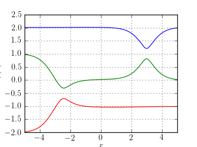

Potential ``three_quadratic``
^^^^^^^^^^^^^^^^^^^^^^^^^^^^^^

* Formula: :math:`V(x) = \left[\begin{smallmatrix}\frac{1}{2} \sigma x^{2} & 0 & 0\\0 & \frac{1}{2} \sigma x^{2} & 0\\0 & 0 & \frac{1}{2} \sigma x^{2}\end{smallmatrix}\right]`

* Default values:

  * :math:`\sigma = 0.05`

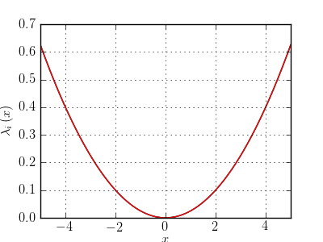

Potential ``two_crossings``
^^^^^^^^^^^^^^^^^^^^^^^^^^^^

* Formula: :math:`V(x) = \left[\begin{smallmatrix}\frac{1}{2} \tanh{\left (- \rho + x \right )} \tanh{\left (\rho + x \right )} & \frac{1}{2} \delta\\\frac{1}{2} \delta & - \frac{1}{2} \tanh{\left (- \rho + x \right )} \tanh{\left (\rho + x \right )}\end{smallmatrix}\right]`

* Default values:

  * :math:`\rho = 3.0`

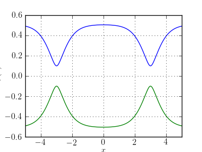

Potential ``two_quadratic``
^^^^^^^^^^^^^^^^^^^^^^^^^^^^

* Formula: :math:`V(x) = \left[\begin{smallmatrix}\frac{1}{2} \sigma x^{2} & 0\\0 & \frac{1}{2} \sigma x^{2}\end{smallmatrix}\right]`

* Default values:

  * :math:`\sigma = 0.05`

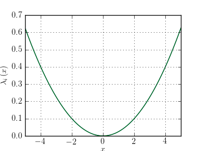

Potential ``two_quartic``
^^^^^^^^^^^^^^^^^^^^^^^^^^

* Formula: :math:`V(x) = \left[\begin{smallmatrix}\frac{1}{4} \sigma x^{4} & 0\\0 & \frac{1}{8} \sigma x^{4}\end{smallmatrix}\right]`

* Default values:

  * :math:`\sigma = 1`

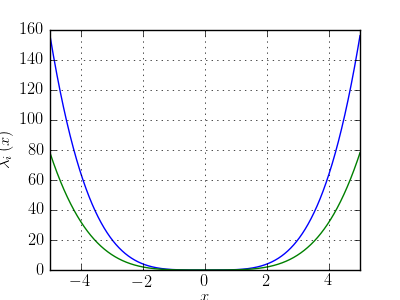

Potential ``v_shape``
^^^^^^^^^^^^^^^^^^^^^^

* Formula: :math:`V(x) = \frac{1}{2} \sqrt{4 \delta^{2} + \tanh^{2}{\left (x \right )}}`

* Default values:

  * :math:`\delta = 0.2`

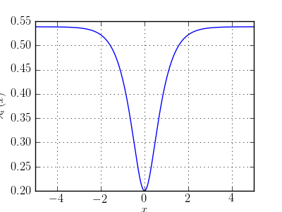

Potential ``wall``
^^^^^^^^^^^^^^^^^^^

* Formula: :math:`V(x) = \operatorname{atan}{\left (\sigma x \right )} + \frac{1}{2} \pi`

* Default values:

  * :math:`\sigma = 10.0`

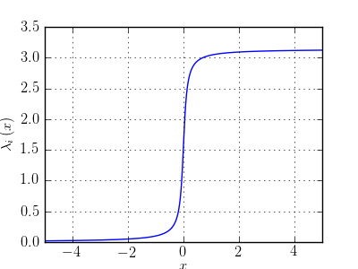
