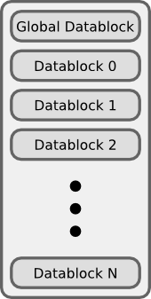
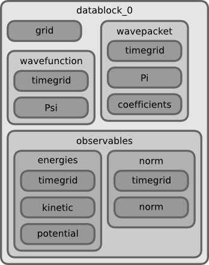

The Core and User scripts
=========================

The big picture
---------------

The ``WaveBlocks`` project is split into two parts. The first part (and this is called
``WaveBlocks`` too) is nothing else than a library or python package which collects
code modules that are general enough to be useful in many different applications
and simulation contexts. The second part consists of several scripts that use
code from the ``WaveBlocks`` package via python's ``import`` statement and perform
simulations, do data evaluation, plotting and much more. Some of these scripts
are fairly general (for example the one responsible for plotting energies) while
others originated from a single very specific research question ...

In the Core
-----------

In this section we describe the important parts of the ``WaveBlocks``
package from a user point of view.

Time propagation algorithms
---------------------------

At the moment, three algorithms for time propagation of initial values are
implemented.

=============  ========================================
Name           Description
=============  ========================================
fourier        Fourier propagation / Operator splitting
hagedorn       Homogeneous Hagedorn wavepackets
multihagedorn  Inhomogeneous Hagedorn wavepackets
=============  ========================================

.. spawn          Spawning propagation for tunneling problems

Specifying initial values
-------------------------

.. warning::

  The following sections describe the settings of the old WaveBlocks
  code and do not apply to `WaveBlocksND`.

Initial values are always specified as wavepackets. For the Fourier propagator,
the packets are sampled at the grid nodes and for packet based algorithms, these
initial packets are just propagated. The two configuration variables ``parameters``
and ``coefficients`` are responsible for specifying the initial wavepackets.
Their values are interpreted as usual but let's look at this important part
a bit closer.

For the ``fourier`` Propagator
^^^^^^^^^^^^^^^^^^^^^^^^^^^^^^

The initial values for the ``fourier`` propagator are given in the simulation
configuration file by the variable ``initial_values``. The data format is
a list of arbitrary length. Each entry is a list itself having the format::

  [ level, parameters, [(index,value), (index,value), ...] ]

where the ``level`` is the energy level, the ``parameters`` is a 5-tuple
of the usual form ``(q,p,Q,P,S)`` containing the wavepacket's parameter. The
third part is a list containing one or several ``(index,value)`` pairs
which hold the value :math:`c_i` of the coefficient with index :math:`i`. We know
that this is all the data necessary for constructing a wavepacket that lives on
the given energy level. (But remember that these packets are sampled at the grid
nodes later to be usable for the Fourier propagation.)

This input format allows us to place several wavepackets on the same energy level,
for example the following valid specification places two Gaussian packets
which will run into each other and bounce off::

  initial_values = [[ 0, (P, Q, S, -0.5,  2.0), [(0,1.0)]],
                    [ 0, (P, Q, S,  0.5, -2.0), [(0,1.0)]]]

For compatibility reasons the input can also be of the format described
in the next two sections. This allows for sharing of simulation configurations.

For the ``hagedorn`` Propagator
^^^^^^^^^^^^^^^^^^^^^^^^^^^^^^^

For this propagator we need one set of parameters which belong to
the leading component. With these parameters we then set up a homogeneous
wavepacket. We can specify the parameters as follows::

  parameters = (q, p, Q, P, S)

with some meaningful values for :math:`Q`, :math:`P`, :math:`S` and :math:`q`
and :math:`p`. For compatibility with the inhomogeneous case, we can also
specify the parameters as::

  parameters = [ (P0, Q0, S0, p0, q0), ..., (Pn, Qn, Sn, pn, qn) ]

where there are as many inner tuples as energy levels. The initialisation
code then picks just the single tuple with its index matching the
``leading_component`` value. This allows easy sharing of
configuration files with minimal editing.

The coefficients :math:`c_i` of the linear combination are specified for each
level separately. There is a list of ``(index,value)`` pairs for
each energy level and all these lists are collected in one big list
assigned to the variable ``coefficients``. This could for example look like::

  coefficients = [[ (0,1.0), (2,0.5), (4,0.2)],
                  [ (0,0.1), (3,1.2)]]

where we have two energy levels (note that the wave function here is not normalized!).
These ``(index,value)`` pairs give the value :math:`c_i` of the coefficient
with index :math:`i`. For example the list containing only the pair ``[ (2,1.0) ]``
yields a :math:`\varphi_2` packet while the list ``[ (0,0.5), (1,0.5) ]`` gives
a superposition of :math:`\frac{1}{2} \left( \varphi_0 + \varphi_1 \right)`. If you
wish to have no wavepacket on an energy level just provide the dummy pair ``[ (0,0.0) ]``.

For the ``multihagedorn`` Propagator
^^^^^^^^^^^^^^^^^^^^^^^^^^^^^^^^^^^^

This propagator needs a set of parameters for each energy level. Thus
the data structure must look like::

    parameters = [ (P0, Q0, S0, p0, q0), ..., (Pn, Qn, Sn, pn, qn) ]

where there are as many inner tuples as energy levels. The coefficients :math:`c_i`
are specified the same way as in the homogeneous case above.

Required parameter sets
-----------------------

The simulations can be configured with a very flexible scheme. One must only
specify the values that are really necessary and can omit all others. There
are some input parameters that have to be provided in any case and many others that
are only necessary for a specific algorithm or are purely optional.

In this section all parameters that can be provided are listed.
You are free to define additional parameters and use them in a data evaluation
script. Just make sure there is no variable name clash.

Parameters for all propagation algorithms
^^^^^^^^^^^^^^^^^^^^^^^^^^^^^^^^^^^^^^^^^

``algorithm``
  The simulation algorithm.

  * Possible values: ``fourier``, ``hagedorn``, ``multihagedorn``
  * Data type: string

``potential``
  The potential

  * Possible values: see Section :ref:`Ready made Potentials`
  * Data type: string or dict

``T``
  The time when the simulation stops

  * Possible values: Non-negative float
  * Data type: float

``dt``
  The size of a single time step

  * Possible values: Non-negative float
  * Data type: float

``eps``
  The semi-classical scaling parameter

  * Possible values: Non-negative float
  * Data type: float

``parameters``
  The Hagedorn parameters :math:`\{P, Q, S, p, q \}` of the
  initial wavepackets. The exact format of this variable depends on the
  simulation algorithm used, see above.

``coefficients``
  A list with the lists of (index,value) tuples that
  set the coefficients of the basis functions for the initial wavepackets. The
  exact format of this variable depends on the simulation algorithm used, see above.

``write_nth``
  Save simulation data every n-th timestep

  * Possible values: Positive Integer where the case 0 is interpreted as
                     *never*. In this case only the initial values are saved.
  * Data type: integer
  * Default value: is 0 if no other value is provided.

``save_at``
  A list of times and/or timesteps when saving of the
  simulation data takes place. (Which data are saved depends on the implementation
  of the respective ``SimulationLoop`` subclass.)

  * Possible values: A list of integers and/or floats. Integers are interpreted
                     as timesteps and floats as (absolute) times. Always be aware
                     of this difference in interpretation!
  * Data type: integer or float
  * Default value: an empty list, thus saving at special points in time
                   is not enabled.

``matrix_exponential``
  Choose the algorithm used for computing the matrix exponential.

  * Possible values: ``"pade"``, ``"arnoldi"``
  * Data type: string
  * Default value: ``"arnoldi"``

``arnoldi_steps``
  The number of arnoldi steps performed. Use this together with
  the parameter ``matrix_exponential`` set to ``"arnoldi"``.

  * Possible values: positive integers
  * Data type: integer
  * Default value: 20

Parameters for the ``fourier`` propagator
^^^^^^^^^^^^^^^^^^^^^^^^^^^^^^^^^^^^^^^^^

``initial_values``
  A specific input format for the initial values. This allows to
  place an arbitrary number of wavepackets on any energy level.
  A valid configuration must either have this variable set or both of
  ``parameters`` and ``coefficients``. If all three are given, this
  takes precedence.

``ngn``
  The number of grid nodes used for the Fourier transformation.

  * Possible values: Integer, optimal is a power of 2 but this is not necessary.
  * Data type: integer

``f``
  A scalar number that determines the extension of the computational domain.

  * Possible values: A non-negative float
  * Data type: float

.. Note::
   You must specify a ``basis_size`` (see below) for the Fourier
   propagator too because we compute initial values from wavepackets.

Parameters for the ``hagedorn`` propagator
^^^^^^^^^^^^^^^^^^^^^^^^^^^^^^^^^^^^^^^^^^

``basis_size``
  Number of basis functions used for homogeneous Hagedorn wavepackets.

  * Possible values: Non-negative integer larger than 2.
  * Data type: integer

``leading_component``
  The leading component is the eigenvalue that governs the propagation
  of the wavepackets' parameters.

  * Possible values: Integer in the range 0 to :math:`N-1` inclusive,
                     where :math:`N` is the number of energy levels the
                     given potential supports.
  * Data type: integer

Parameters for the ``multihagedorn`` propagator
^^^^^^^^^^^^^^^^^^^^^^^^^^^^^^^^^^^^^^^^^^^^^^^

``basis_size``
  Number of basis functions used for inhomogeneous Hagedorn packets.

  * Possible values: Non-negative integer larger than 2.
  * Data type: integer

Optional parameters
^^^^^^^^^^^^^^^^^^^

All variables that appear as parameters of some potential can be specified
here. For example, the ``quadratic`` potential has a parameter ``sigma``
which can be given in the simulation configuration. (Otherwise a default value
would be used.) For potentials that contain parameters for which no default
values are specified, these parameters must be given in the configuration file.
An example of such a parameter is the ``delta`` of the ``delta_gap`` potential.

Parameters related to spawning
^^^^^^^^^^^^^^^^^^^^^^^^^^^^^^

.. warning::

   The spawning algorithms are not supported in the new ``WaveBlocksND`` code yet.

There are a number of parameters which are all related to the different
spawning techniques. The name of these parameters always starts with the prefix
``spawn``. It is beyond the scope of this document to explain the details
of the spawning techniques and also the theoretical origin of the various parameters.

To enable spawning, the configuration parameter ``algorithm`` can be set
to additional values not mentioned above.

``algorithm``
  The simulation algorithm

  * Possible values: ``"spawning_adiabatic"``, ``"spawning_nonadiabatic"``
  * Data type: string

Since these algorithms make use of the homogeneous Hagedorn propagation internally,
all variables related to this propagator must be set additionally.

Then there is a bunch of parameters controlling the details of the spawning
process. Most of these variables must be set properly, some are optional
depending on specific choices for others.

``spawn_method``
  Specify the spawning method used. If set to ``lumping`` we just spawn a
  normed wavepacket by copying over the norm of the `spawn candidate`. If
  set to ``projection`` a full basis projection is done up to the maximal
  order given by the parameter ``spawn_max_order``. (Always set this value
  too.)

  * Possible values: ``"lumping"`` or ``"projection"``
  * Data type: string

``spawn_max_order``
  The maximal order (size) of the spawned wavepacket i.e. on how many new basis
  functions the basis projection is performed. This only makes sense in
  combination with the ``spawn_method`` parameter set to ``projection``.

  * Possible values: Non-negative integer in the range :math:`\left[0, \ldots, K\right]`
                     where :math:`K` is the basis size given by ``basis_size``.
  * Data type: integer

.. Note::
   This ``spawn_max_order`` is *not* the basis size of the spawned wavepacket.
   (Which we currently can not control.)

``spawn_order``
  The spawned wavepacket is assumed to be of the form of :math:`\phi_k` at leading
  order. This is not always true but we need the value of :math:`k` in the algorithms
  for formal reasons. If the value of :math:`k` is wrong then the results may be
  much worse. (Consider this to be a limitation of the current algorithms.)

  * Possible values: Non-negative integer in the range :math:`\left[0, \ldots, K\right]`
                     where :math:`K` is the basis size given by ``basis_size``.
  * Data type: integer

Finally, we have several possibilities how we decide if and when to spawn. This
criterion or `oracle` has to be set by the following variable. There is an
open set of possibilities, more criteria may be added in the future. All values
are class names of the classes that implement the corresponding condition. The
implementations can be found in the file ``SpawnConditions.py``.

``spawn_condition``
  Specify the spawning condition used to decide if and when spawning should occur.

  * Possible values: ``"spawn_at_time"``, ``"norm_threshold"``, ``"high_k_norm_threshold"``,
                     ``"high_k_norm_derivative_threshold"``, ``"norm_derivative_threshold_l2"``,
                     ``"norm_derivative_threshold_max"``
  * Data type: string

.. Note::
   If in doubt, try using ``norm_threshold`` or ``norm_derivative_threshold_l2``
   with sensible values for the related parameters. (Choosing good values for these
   parameters is the most difficult part.)

Each of these methods depend on one or several more parameters configuring their
behaviour in detail. These parameters are described in the following list.

``spawn_threshold``
  The spawning threshold is compared to the norm of the fragment or `spawning candidate`
  examined. Its norm has to exceed this value in order to initiate the spawning process.

  * Possible values: Non-negative float (should be between 0.0 and 1.0)
  * Data type: float
  * Used by: All methods. (Because it is used in the parameter estimation process
             to avoid division by zero.) The methods ``norm_threshold`` and
             ``high_k_norm_threshold`` decide solely on this value. The methods
             ``*_derivative_*`` use this value as a first hint in combination with others.

``spawn_K0``
  The index of the coefficient :math:`c_{K0}` where splitting in low and high
  coefficients is applied. (:math:`c_{K0}` is included into the set of high ones.)

  * Possible values: Non-negative integer in the range :math:`\left[0, \ldots, K\right]`
                     where :math:`K` is the basis size given by :math:`basis_size`.
  * Data type: integer
  * Used by: The conditions ``high_k_norm_threshold`` and ``high_k_norm_derivative_threshold``.
             This parameter is also used by all method that do a low/high filtering.

``spawn_hist_len``
  The length of the history measured in number of samples.

  * Possible values: Positive integers. Values in the range of 5 up to
                     about 30 are probably good choices.
  * Data type: integer
  * Used by: All methods that keep a history and remember their past.
             In particular these are:
             ``high_k_norm_derivative_threshold``,
             ``norm_derivative_threshold_l2``,
             ``norm_derivative_threshold_max``.

``spawn_deriv_threshold``
  The threshold applied to the derivative of the norm of the fragment examined for
  spawning. The derivative is usually approximated by simple finite differences.

  * Possible values: (Small) real positive values
  * Data type: float
  * Used by: The methods
             ``high_k_norm_derivative_threshold``,
             ``norm_derivative_threshold_l2``,
             ``norm_derivative_threshold_max``

``spawn_time``
  The time when we want to spawn.

  * Possible values: Real values in the range :math:`[0, T]`. The values will
                     be rounded to the nearest timestep interval.
  * Data type: float
  * Used by: The method ``spawn_at_time``.

Parameters related to aposteriori spawning
^^^^^^^^^^^^^^^^^^^^^^^^^^^^^^^^^^^^^^^^^^

In addition to the algorithms that combine propagation with spawning there are
also algorithms which perform an aposteriori analysis of spawning methods. They
can be chosen by the following values for the parameter ``algorithm``.

``algorithm``
  The simulation algorithm

  * Possible values: ``"spawning_apost"`` and ``"spawning_apost_na"``
  * Data type: string

.. Note::
   These values are currently unused.

In the non-adiabatic case we might be interested on specific energy levels only.
These level can be set by the following variable. (This does not apply to the
algorithms from the last section.)

``spawn_components``
  The energy levels on which spawning is tried.

  * Possible values: List of integers between 0 and the number of energy levels.
  * Data type: list or tuple

All other parameters from the last section must be used additionally to configure
the details of the spawning process.

For this very specialised problem setting you have to use the scripts
``AposterioriSpawning.py`` and ``AposterioriSpawningNA.py``. These scripts
perform the aposteriori analysis on some given simulation data. They produce
new data files which then can be evaluated with the usual tools.

Data storage
------------

What data are written to disk. How can we retrieve data, IOM basics, usage, etc

How IOM works
^^^^^^^^^^^^^

The so-called `IOManager` is responsible for storing all our data. It provides a
meaningful API for storing and retrieving simulation data and the goal is to
make data handling from scripts as easy as possible. The IOManager uses the low-level
``hdf5`` file format to actually store the numerical data efficiently. Dealing directly
with the hdf5 API provided by ``h5py`` would be cumbersome as we would have
to remember much more details about how the data are stored inside an hdf file.
With this thin layer we just tell the IOM which data we want to store or load and
it performs all the low-level stuff behind our back.

Please note that the tab-completion of ``ipython`` won't work as usual
on ``IOManager`` instances because of its plugin architecture. The plugins
allow to add functionality at runtime and only when its really used. Thus a
(member)function may be loaded right at the moment it gets called the first time.
This is the reason why tab-completion and introspection will not work for
(member)functions that had never been called before.

What gets stored
^^^^^^^^^^^^^^^^

Each file containing simulation results is basically divided into `datablocks`.
There is one special block called the `global datablock` which stores
data that are identical for the whole simulation (for example space domain grids,
simulation parameters etc). Then there can be an arbitrary number of normal data
blocks which can store various data related to wavepackets, wavefunctions and observables.
Each of these data sets is optional and there are functions to query if specified
data is available. The next figure shows the coarse structure of any simulation
results file.

   Coarse structure of a file containing simulation results.

The figure below shows the internal structure of a single data block.
In this structure not all data objects always exist depending on what
computations were performed. The dark blocks are at the level of individual data
tensors while the lighter grey boxes represent hdf groups. Note that not all data
sets may exist at all and that each group can have different subsets. For example
if you never computed observables, then this entire block is missing. The
wavefunction data can come from a simulation with the Fourier propagator or from
the evaluation of wavepackets on a given domain-wide grid.

   Possible structure of a single data block. Not all data always exist.

Saving data at times and timesteps
^^^^^^^^^^^^^^^^^^^^^^^^^^^^^^^^^^

Storing simulation data can happen in various different ways. For example you
can store data at regular time intervals. Or at a list of fixed points in time.
Both is easily possible with the tools provided by the ``IOManager`` together
with the ``TimeManager``. While the ``IOManager`` is responsible for
saving and loading the data, the ``TimeManager`` is used for all computations
related with time, timesteps and so on, for example to convert a list of times
into a list of timesteps or checking if a given time is is within the simulated
time range etc.

The two parameters ``write_nth`` and ``save_at`` are used to configure the
way you wish to save data. While the first is used to specify the details of saving
at regular time intervals, the second one provides the means to specify a list
of points in time when saving should take place. A few examples of saving at regular
intervals::

  # Save data at each timestep
  write_nth = 1

  # Save data each 5th timestep
  write_nth = 5

  # Never save data
  write_nth = 0

Please note that this scheme is rigid in the sense that if for example the timestep
corresponding to the end of the simulation is not an integer multiple of the value
of this parameter then the data from the end is missing. (This should be quite obvious!)

The parameter ``save_at`` has to be a python list containing integers
and/or floats. There is a *big difference* between the two data types
you always have to be aware of! Integer values are interpreted as `timesteps`
while floats will be taken as `times`. A few examples on saving at specified
times only::

  # Save at timestep 3, 6, 7, 13 and 19
  save_at = [3, 6, 7, 13, 19]

  # Save at the end time only
  # Assuming T = 5.34 and T is an integer multiple of dt!
  save_at = [5.34]

  # Save at a few times
  # This is usefull to compare simulation results of simulations
  # with different timestep sizes. Of course the times have to be
  # integer multiples of *all* timestep sizes in consideration!
  save_at = [3.2, 4.5, 8.7, 19.3]

You can freely mix the two approaches and specify crazy things like
the following::

  write_nth = 15
  save_at = [1, 2, 3, 4.5, 10, 3.2, 40, 23.45, 23.55]

which translates to the: `Save the data each 15 steps and additionally
save the data at the timesteps 1, 2, 3, 10 and 40 and save the data at the time 3.2,
23.45 and 23.55.` It is assumed that `time` is an integer multiple of the
``timestep`` size. (Otherwise more or less careful rounding will be applied.)
The list doesn't have to be in monotone order and duplicates will be removed as well
as values outside the interval :math:`[0, T]` where :math:`T` is the time at which
the simulation stops. A good use case for a mixed specification is for example saving at big
intervals but including the very end of the simulation::

  write_nth = 35
  save_at = [5.34]    # Same assumption as above

Note that even if you disable saving data entirely be setting::

  write_nth = 0     # Default is 1
  save_at = []      # Default is []

you will end up with a hdf5 file still containing the initial values as they
are at time equal 0 (before the first timestep was made).

Retrieving the simulation parameters
^^^^^^^^^^^^^^^^^^^^^^^^^^^^^^^^^^^^

From a hdf5 file with the simulation data we can get back the parameters this
simulation used. Retrieval is trivial, the following commented interactive python
session shows the basics which can of course be used in a user script too::

  >>> from WaveBlocks import IOManager
  >>> iom = IOManager()                         # create an IOM instance
  >>> iom.load_file("simulation_results.hdf5")  # load the data file
  >>> sim_params = iom.get_parameters()         # request the parameters
  >>> print(sim_params)
  ====================================
  Parameters of the current simulation
  ------------------------------------
  [...]

With only three trivial lines of code we get back all the parameters
that were used for the simulation!

Load simulation data
^^^^^^^^^^^^^^^^^^^^

Simulation data can be loaded from a given ``simulation_results.hdf5`` file by
an IOManager instance. You can even do this inside an interactive ``ipython``
session. The API is quite trivial, all functions for loading data have their name
prefixed by ``load_`` as for example in ``load_energy(...)``. Every function
for loading and saving data has a keyword argument ``block`` defaulting to 0
which tells the IOManager from which data block to take the requested data.
For quantities that represent time series, the load functions also provide a keyword
argument ``timestep`` that can be used to load data from a single timestep.
The default is ``None`` meaning `load the data from all timesteps`.
A sample of such an interactive session could look like this::

  >>> from WaveBlocks import IOManager
  >>> iom = IOManager()                          # Create a new IOManager instance
  >>> iom.open_file("simulation_results.hdf5")   # And open a given hdf5 file

  >>> print(iom)
    IOManager instance with open file simulation_results.hdf5

  >>> ekin, epot = iom.load_energy()         # Load the energies from a simulation
    Requested function: load_energy          # Don't bother about the messages
    Plugin to load: IOM_plugin_energy        # concerning the plugins.

  >>> ekin.shape                             # We see the the energies are given
    (301, 1)                                 # as time series over 301 timesteps
  >>> epot.shape
    (301, 1)

  >>> tg = iom.load_energy_timegrid()        # Load the corresponding timegrid which
                                             # contains the timesteps when the data
  >>> tg.shape                               # was saved. This is important if the
    (301,)                                   # data was saved at non-regular intervalls.

  >>> iom.finalize()                         # Close the hdf5 file

  >>> plot(tg, ekin)                         # Plot the kinetic energy over time

Of course all this works exactly the same inside any regular python script.
For a complete list of all the ``load_`` functions please see the API
documentation or the docstrings.

Working with simulation data
^^^^^^^^^^^^^^^^^^^^^^^^^^^^

The following code snippet shows how to perform a data transformation task
for all blocks of a simulation results file.::

  >>> iom = IOManager()
  >>> iom.open_file("testdata.hdf5")

  >>> for blockid in iom.get_block_ids():      # Iterate over all data blocks
          if iom.has_energy(block=blockid):    # If the current data block containes
              ...                              # energies we may do something

User scripts
------------

Consider merging this section with chapter 2.
Do an explicit example walk through somewhere.

Preparing simulations
^^^^^^^^^^^^^^^^^^^^^

Preparing a whole bunch of simulations is easy. Given the `metaconfiguration`
file we call the script `ConfigurationGenerator.py` like:

::

  python ConfigurationGenerator.py  <metaconfiguration.py> <configurations_dir>

where the ``configurations_dir`` is optional. If not given a directory called
``autogen_configurations`` will be created. Remember to move the configuration
to the ``configurations`` directory if you plan to use the ``Batch.py`` script.

Generating Configurations
^^^^^^^^^^^^^^^^^^^^^^^^^

In detail description on how to generate valid configurations

Manually
''''''''

Meta-configurations
'''''''''''''''''''

The best approach to write a `metaconfiguration` file is to
copy an existing one from the ``examples`` directory.

The rules for valid files are as follows:

* You can use any valid python statement as value
* All statements are written to a pure python code file
* You can write numbers, lists etc as plain text strings
* All that is not in string form gets evaluated **right now**
* Remember to escape python strings twice
* You can use variable references but with great care!
* The ordering of the statements in the output file is such that
  all statements can be executed w.r.t. local variables. This is
  some kind of topological sorting. Be warned, it's implemented
  using black magic and may fail now and then!

That should be all ...

Running simulations
^^^^^^^^^^^^^^^^^^^

To run a single simulation, use the ``Main.py`` script. The first command-line
argument is the simulation configuration file (with an arbitrary file path)::

  python Main.py path/to/the/simulationparameters.py

The results will be written to the file ``simulation_results.hdf5`` in the
`local` directory where the script was called and `not` where the configuration
file was loaded from. The script refuses to run if there is already a file
``simulation_results.hdf5`` in the local directory. This is to prevent you
from data loss.

To run a bunch of simulations, use the script called ``Batch.py``. It
has three command line parameters and all are optional with sensible defaults.
The first specifies the `batch configuration` that will be used. The second
is a directory path pointing to the directory where the configuration files
are located. All python files within that directory (excluding recursive descent)
will be treated as simulation configurations. The directory path defaults to
``./configurations/``. Last but not least the third argument specifies the
directory path where the simulation results (numerical data, plots etc) will be
placed after the simulation finishes. This defaults to ``./results/``
with one subdirectory for each simulation configuration. A call looks like::

  python Batch.py batchconfiguration.py configurations_dir results_dir

This is all you need to know to be able to run simulations.

Computing additional data
^^^^^^^^^^^^^^^^^^^^^^^^^

Only compute/store what comes out directly from the time propagation
(Or what would be much more difficult to computer afterwards)

Compute all other data in a separate step after the simulation finished
Example: Norms, energies etc

Evaluating data
^^^^^^^^^^^^^^^

Further computations

Plot data
^^^^^^^^^

Call plot scripts which load the simulation data from a file and plot
some values.
