Ready made Potentials
---------------------

The following sections contain some potentials that are implemented in the potential
library. The plots show the eigenvalues or energy surfaces. Some potentials
have additional parameters, the default values for these are also Name.

Potential ``cos_osc``
^^^^^^^^^^^^^^^^^^^^^

* Formula: :math:`V(x) = a \left(- \cos{\left (b x \right )} + 1\right)`

* Variables: :math:`x`

* Default values:

  * :math:`a = 0.07`
  * :math:`b = 1.0`

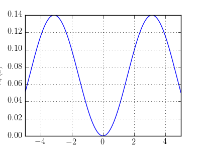

Potential ``cosh_osc``
^^^^^^^^^^^^^^^^^^^^^^

* Formula: :math:`V(x) = a \cosh{\left (b x \right )}`

* Variables: :math:`x`

* Default values:

  * :math:`a = 1`
  * :math:`b = 1`

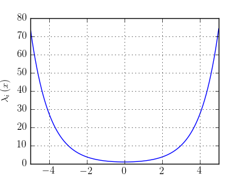

Potential ``double_well``
^^^^^^^^^^^^^^^^^^^^^^^^^

* Formula: :math:`V(x) = \sigma \left(x^{2} - 1\right)^{2}`

* Variables: :math:`x`

* Default values:

  * :math:`\sigma = 1.0`

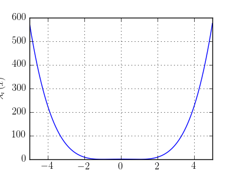

Potential ``double_well2``
^^^^^^^^^^^^^^^^^^^^^^^^^^

* Formula: :math:`V(x) = a x^{4} - b x^{2}`

* Variables: :math:`x`

* Default values:

  * :math:`a = 1.0`
  * :math:`b = 1.0`

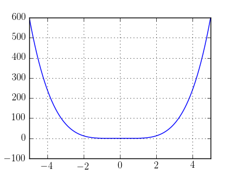

Potential ``eckart``
^^^^^^^^^^^^^^^^^^^^

* Formula: :math:`V(x) = \frac{\sigma}{\cosh^{2}{\left (\frac{x}{a} \right )}}`

* Variables: :math:`x`

* Default values:

  * :math:`a = 0.944858082316`
  * :math:`\sigma = 0.038088`

.. image:: fig/eckart.png

Potential ``free_particle``
^^^^^^^^^^^^^^^^^^^^^^^^^^^

* Formula: :math:`V(x) = c`

* Variables: :math:`x`

* Default values:

  * :math:`c = 0`

.. image:: fig/free_particle.png

Potential ``kratzer``
^^^^^^^^^^^^^^^^^^^^^

* Formula: :math:`V(x) = \frac{b \left(b - 1\right)}{2 x^{2}} + \frac{x^{2}}{2}`

* Variables: :math:`x`

* Default values:

  * :math:`b = 2.0`

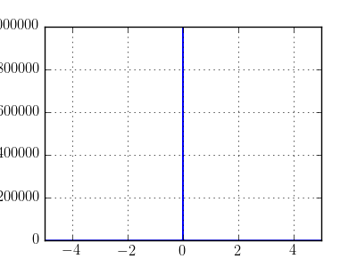

Potential ``morse``
^^^^^^^^^^^^^^^^^^^

* Formula: :math:`V(x) = D \left(1 - e^{- a \left(x - x_{0}\right)}\right)^{2}`

* Variables: :math:`x`

* Default values:

  * :math:`a = 0.5`
  * :math:`x_{0} = 0.0`
  * :math:`D = 3.0`

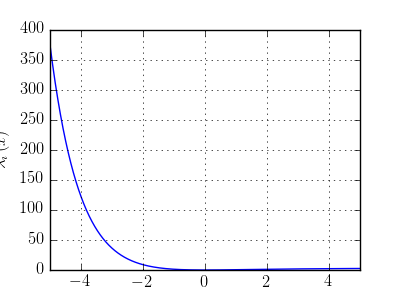

Potential ``morse_zero``
^^^^^^^^^^^^^^^^^^^^^^^^

* Formula: :math:`V(x) = D \left(- 2 e^{- a \left(x - x_{0}\right)} + e^{- 2 a \left(x - x_{0}\right)}\right)`

* Variables: :math:`x`

* Default values:

  * :math:`a = 0.5`
  * :math:`x_{0} = 0.0`
  * :math:`D = 3.0`

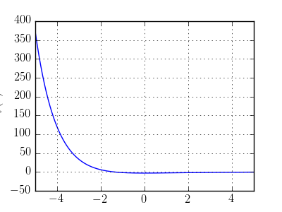

Potential ``morse_zero_2``
^^^^^^^^^^^^^^^^^^^^^^^^^^

* Formula: :math:`V(x) = l^{2} \left(e^{- 2 x + 2 x_{0}} - 2 e^{- x + x_{0}}\right)`

* Variables: :math:`x`

* Default values:

  * :math:`x_{0} = 0.0`
  * :math:`l = 1.0`

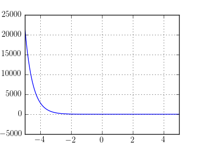

Potential ``pert_quadratic``
^^^^^^^^^^^^^^^^^^^^^^^^^^^^

* Formula: :math:`V(x) = \frac{\delta^{2} x^{2}}{2} + \frac{\sigma x^{2}}{2}`

* Variables: :math:`x`

* Default values:

  * :math:`\sigma = 0.05`
  * :math:`\delta = 0.2`

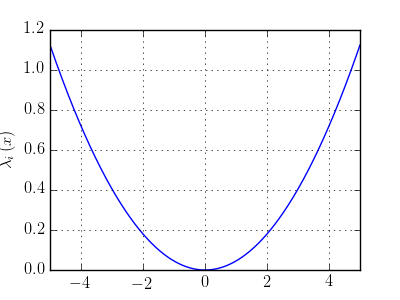

Potential ``quadratic``
^^^^^^^^^^^^^^^^^^^^^^^

* Formula: :math:`V(x) = \frac{\sigma x^{2}}{2}`

* Variables: :math:`x`

* Default values:

  * :math:`\sigma = 1/2`

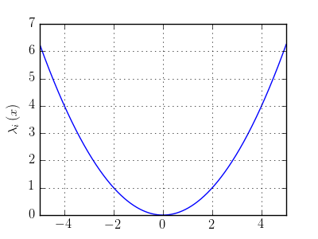

Potential ``quartic``
^^^^^^^^^^^^^^^^^^^^^

* Formula: :math:`V(x) = \frac{\sigma x^{4}}{4}`

* Variables: :math:`x`

* Default values:

  * :math:`\sigma = 0.05`

.. image:: fig/quartic.png

Potential ``v_shape``
^^^^^^^^^^^^^^^^^^^^^

* Formula: :math:`V(x) = \frac{1}{2} \sqrt{4 \delta^{2} + \tanh^{2}{\left (x \right )}}`

* Variables: :math:`x`

* Default values:

  * :math:`\delta = 0.2`

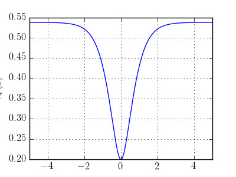

Potential ``wall``
^^^^^^^^^^^^^^^^^^

* Formula: :math:`V(x) = \operatorname{atan}{\left (\sigma x \right )} + \frac{\pi}{2}`

* Variables: :math:`x`

* Default values:

  * :math:`\sigma = 10.0`

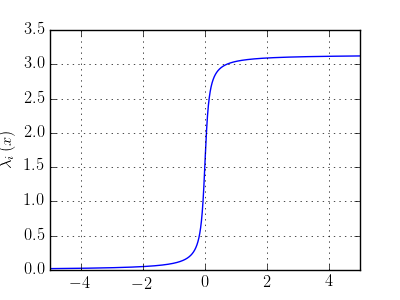

Potential ``delta_gap``
^^^^^^^^^^^^^^^^^^^^^^^

* Formula: :math:`V(x) = \left[\begin{matrix}\frac{1}{2} \tanh{\left (x \right )} & \delta\\\delta & - \frac{1}{2} \tanh{\left (x \right )}\end{matrix}\right]`

* Variables: :math:`x`

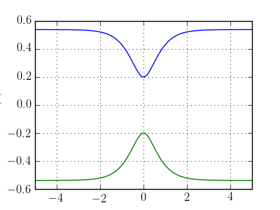

Potential ``delta_gap_diag``
^^^^^^^^^^^^^^^^^^^^^^^^^^^^

* Formula: :math:`V(x) = \left[\begin{matrix}\sqrt{\delta^{2} + \frac{1}{4} \tanh^{2}{\left (x \right )}} & 0\\0 & - \sqrt{\delta^{2} + \frac{1}{4} \tanh^{2}{\left (x \right )}}\end{matrix}\right]`

* Variables: :math:`x`

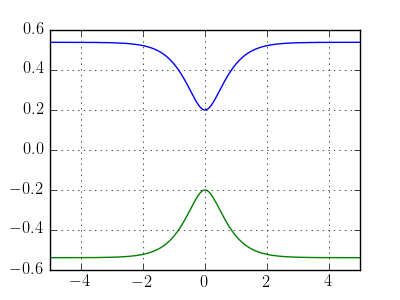

Potential ``two_crossings``
^^^^^^^^^^^^^^^^^^^^^^^^^^^

* Formula: :math:`V(x) = \left[\begin{matrix}\frac{1}{2} \tanh{\left (- \rho + x \right )} \tanh{\left (\rho + x \right )} & \frac{\delta}{2}\\\frac{\delta}{2} & - \frac{1}{2} \tanh{\left (- \rho + x \right )} \tanh{\left (\rho + x \right )}\end{matrix}\right]`

* Variables: :math:`x`

* Default values:

  * :math:`\rho = 3.0`

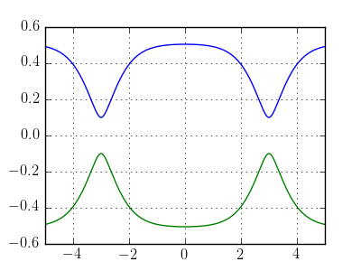

Potential ``two_quadratic``
^^^^^^^^^^^^^^^^^^^^^^^^^^^

* Formula: :math:`V(x) = \left[\begin{matrix}\frac{\sigma x^{2}}{2} & 0\\0 & \frac{\sigma x^{2}}{2}\end{matrix}\right]`

* Variables: :math:`x`

* Default values:

  * :math:`\sigma = 0.05`

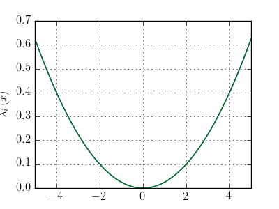

Potential ``two_quartic``
^^^^^^^^^^^^^^^^^^^^^^^^^

* Formula: :math:`V(x) = \left[\begin{matrix}\frac{\sigma x^{4}}{4} & 0\\0 & \frac{\sigma x^{4}}{8}\end{matrix}\right]`

* Variables: :math:`x`

* Default values:

  * :math:`\sigma = 1`

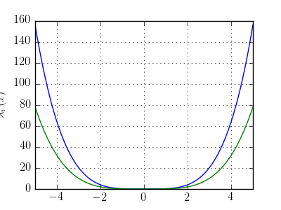

Potential ``three_levels``
^^^^^^^^^^^^^^^^^^^^^^^^^^

* Formula: :math:`V(x) = \left[\begin{matrix}\tanh{\left (- \rho + x \right )} + \tanh{\left (\rho + x \right )} & \delta_{1} & \delta_{2}\\\delta_{1} & - \tanh{\left (\rho + x \right )} & 0\\\delta_{2} & 0 & - \tanh{\left (- \rho + x \right )} + 1\end{matrix}\right]`

* Variables: :math:`x`

* Default values:

  * :math:`\rho = 3.0`

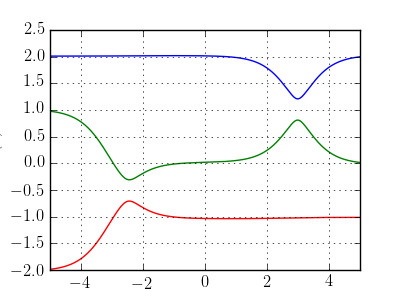

Potential ``three_quadratic``
^^^^^^^^^^^^^^^^^^^^^^^^^^^^^

* Formula: :math:`V(x) = \left[\begin{matrix}\frac{\sigma x^{2}}{2} & 0 & 0\\0 & \frac{\sigma x^{2}}{2} & 0\\0 & 0 & \frac{\sigma x^{2}}{2}\end{matrix}\right]`

* Variables: :math:`x`

* Default values:

  * :math:`\sigma = 0.05`

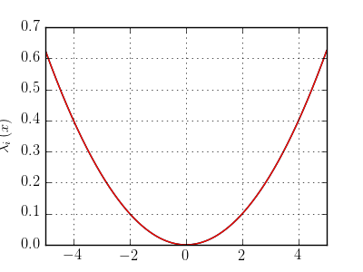

Potential ``four_powers``
^^^^^^^^^^^^^^^^^^^^^^^^^

* Formula: :math:`V(x) = \left[\begin{matrix}\frac{\sigma x^{2}}{2} & 0 & 0 & 0\\0 & \frac{\sigma x^{4}}{4} & 0 & 0\\0 & 0 & \frac{\sigma x^{6}}{6} & 0\\0 & 0 & 0 & \frac{\sigma x^{8}}{8}\end{matrix}\right]`

* Variables: :math:`x`

* Default values:

  * :math:`\sigma = 0.05`

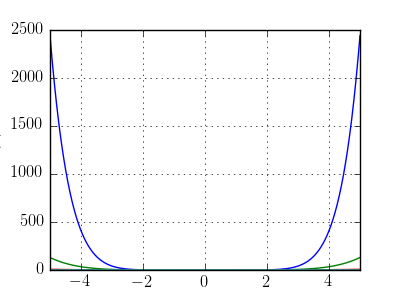

Potential ``four_quadratic``
^^^^^^^^^^^^^^^^^^^^^^^^^^^^

* Formula: :math:`V(x) = \left[\begin{matrix}\frac{\sigma x^{2}}{2} & 0 & 0 & 0\\0 & \frac{\sigma x^{2}}{2} & 0 & 0\\0 & 0 & \frac{\sigma x^{2}}{2} & 0\\0 & 0 & 0 & \frac{\sigma x^{2}}{2}\end{matrix}\right]`

* Variables: :math:`x`

* Default values:

  * :math:`\sigma = 0.05`

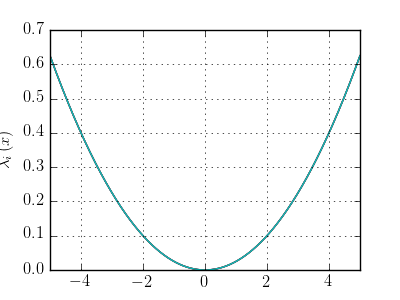

Potential ``five_quadratic``
^^^^^^^^^^^^^^^^^^^^^^^^^^^^

* Formula: :math:`V(x) = \left[\begin{matrix}\frac{\sigma x^{2}}{2} & 0 & 0 & 0 & 0\\0 & \frac{\sigma x^{2}}{2} & 0 & 0 & 0\\0 & 0 & \frac{\sigma x^{2}}{2} & 0 & 0\\0 & 0 & 0 & \frac{\sigma x^{2}}{2} & 0\\0 & 0 & 0 & 0 & \frac{\sigma x^{2}}{2}\end{matrix}\right]`

* Variables: :math:`x`

* Default values:

  * :math:`\sigma = 0.05`

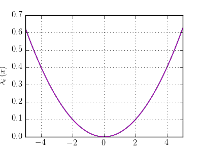

Potential ``channel_2d``
^^^^^^^^^^^^^^^^^^^^^^^^

* Formula: :math:`V(x) = sigmax x + \frac{sigmay y^{2}}{2}`

* Variables: :math:`x`, :math:`y`

* Default values:

  * :math:`sigmay = 0.45`
  * :math:`sigmax = 0.0`

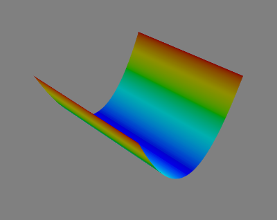

Potential ``circle_pit_2d``
^^^^^^^^^^^^^^^^^^^^^^^^^^^

* Formula: :math:`V(x) = \operatorname{atan}{\left (\sigma \left(- R + \sqrt{x^{2} + y^{2}}\right) \right )} + \frac{\pi}{2}`

* Variables: :math:`x`, :math:`y`

* Default values:

  * :math:`R = 8`
  * :math:`\sigma = 10`

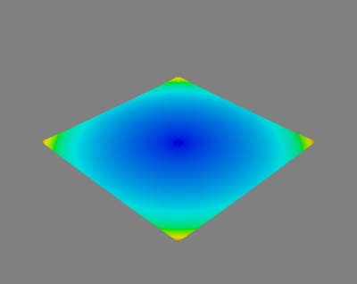

Potential ``corral_ring``
^^^^^^^^^^^^^^^^^^^^^^^^^

* Formula: :math:`V(x) = \frac{1}{2} \sqrt{\delta^{2} + \tanh^{2}{\left (- R + \sqrt{x^{2} + y^{2}} \right )} \tanh^{2}{\left (R + \sqrt{x^{2} + y^{2}} \right )}}`

* Variables: :math:`x`, :math:`y`

* Default values:

  * :math:`R = 3`
  * :math:`\delta = 1/32`

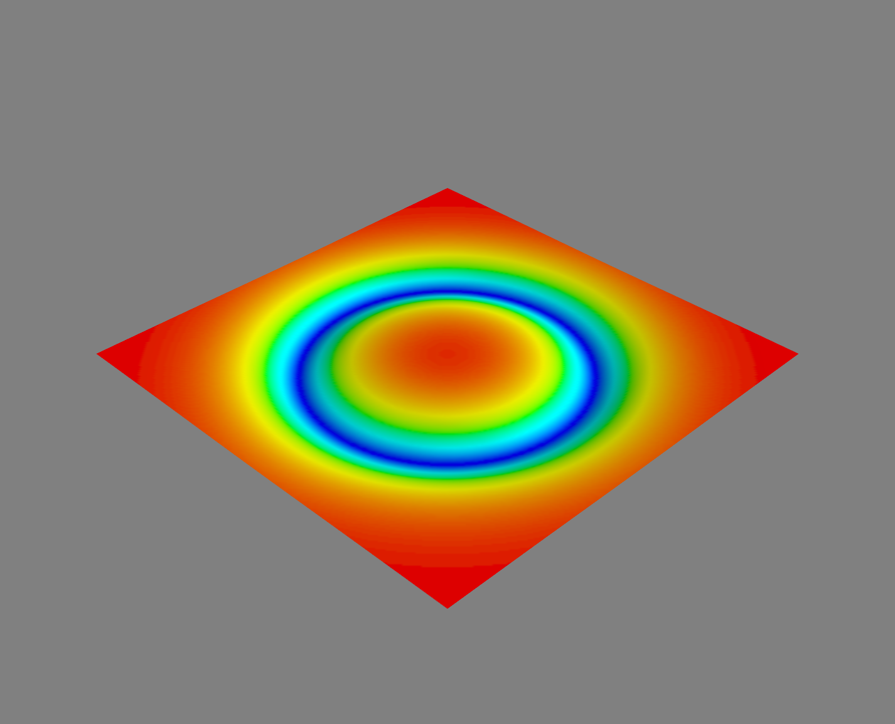

Potential ``corral_rotsym_2d``
^^^^^^^^^^^^^^^^^^^^^^^^^^^^^^

* Formula: :math:`V(x) = \operatorname{atan}{\left (\sigma \left(- R + \sqrt{x^{2} + y^{2}}\right) \right )} + \frac{\pi}{2}`

* Variables: :math:`x`, :math:`y`

* Default values:

  * :math:`R = 8`
  * :math:`\sigma = 10`

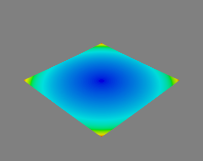

Potential ``cos_osc_2d``
^^^^^^^^^^^^^^^^^^^^^^^^

* Formula: :math:`V(x) = ax \left(- \cos{\left (bx x \right )} + 1\right) + ay \left(- \cos{\left (by y \right )} + 1\right)`

* Variables: :math:`x`, :math:`y`

* Default values:

  * :math:`ay = 1`
  * :math:`ax = 1`
  * :math:`bx = 1`
  * :math:`by = 1`

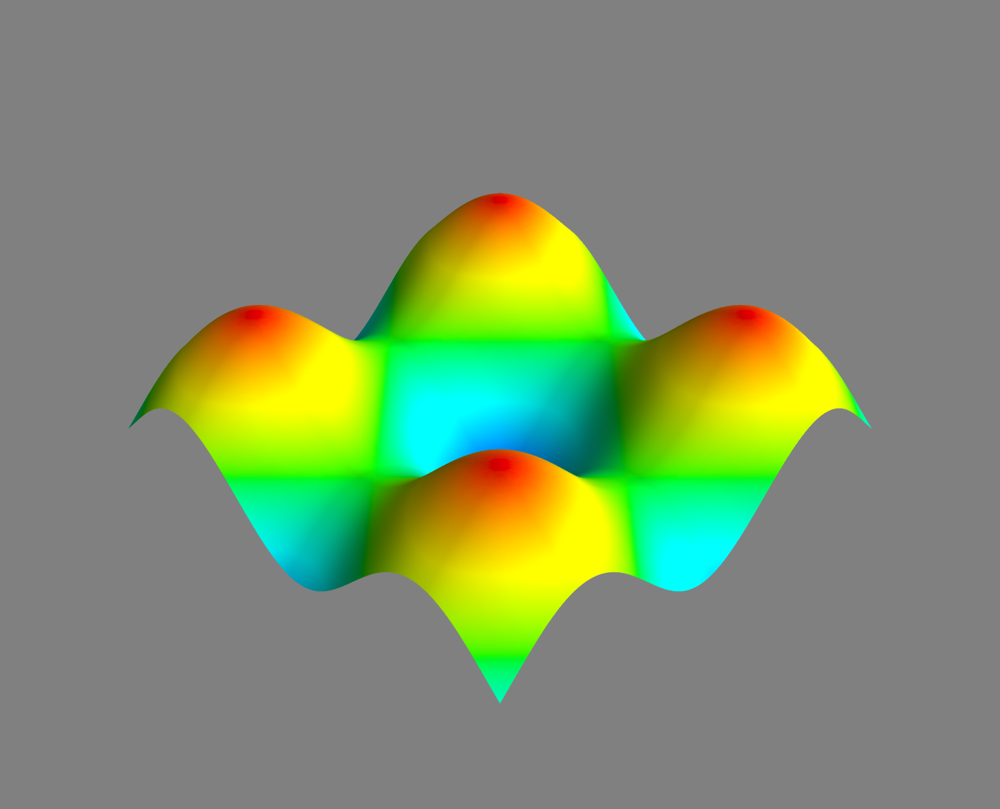

Potential ``cosh_osc_2d``
^^^^^^^^^^^^^^^^^^^^^^^^^

* Formula: :math:`V(x) = a \cosh{\left (b \sqrt{x^{2} + y^{2}} \right )}`

* Variables: :math:`x`, :math:`y`

* Default values:

  * :math:`a = 1`
  * :math:`b = 1`

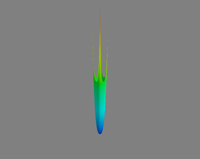

Potential ``gauss_hill_2d``
^^^^^^^^^^^^^^^^^^^^^^^^^^^

* Formula: :math:`V(x) = e^{- sigmax x^{2} - sigmay y^{2}}`

* Variables: :math:`x`, :math:`y`

* Default values:

  * :math:`sigmay = 1`
  * :math:`sigmax = 1`

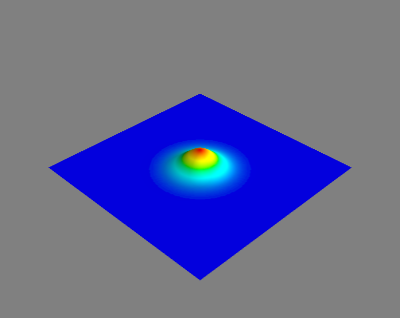

Potential ``morse_threefold``
^^^^^^^^^^^^^^^^^^^^^^^^^^^^^

* Formula: :math:`V(x) = \left(- e^{\left(- \sigma - \frac{1}{16} \left(- \cos{\left (3 \operatorname{atan2}{\left (y,x \right )} \right )} + 1\right)^{2}\right) \left(x^{2} + y^{2}\right)} + 1\right)^{2}`

* Variables: :math:`x`, :math:`y`

* Default values:

  * :math:`\sigma = 0.05`

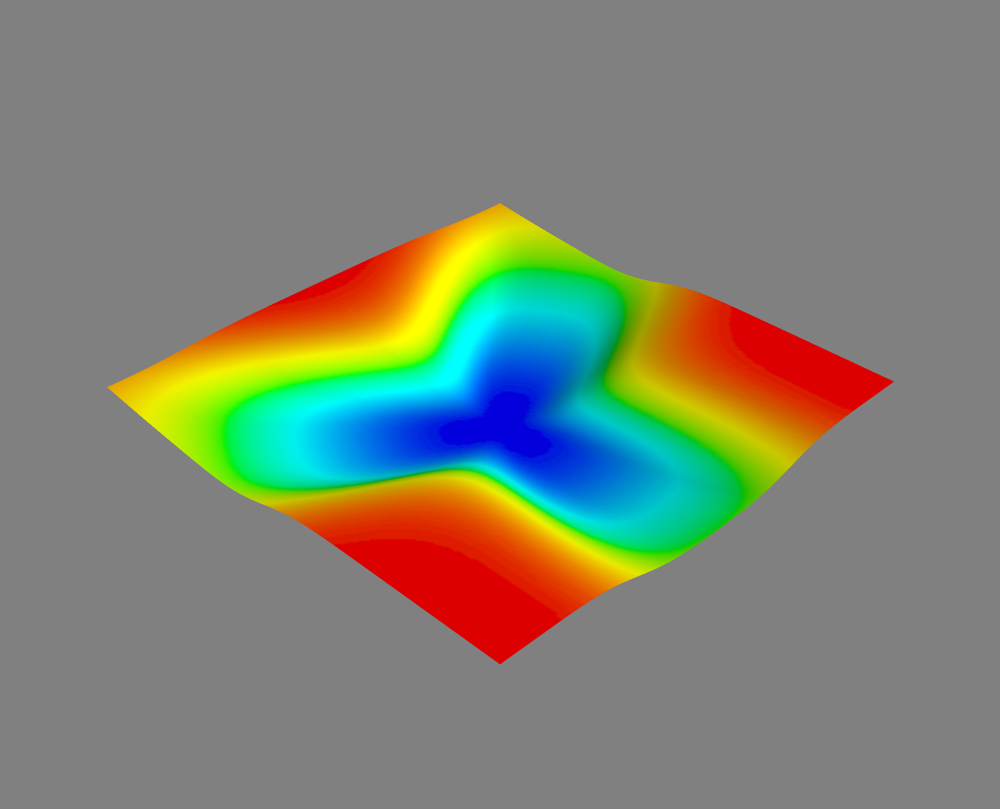

Potential ``quadratic_2d``
^^^^^^^^^^^^^^^^^^^^^^^^^^

* Formula: :math:`V(x) = \frac{sigmax x^{2}}{2} + \frac{sigmay y^{2}}{2}`

* Variables: :math:`x`, :math:`y`

* Default values:

  * :math:`sigmay = 1/2`
  * :math:`sigmax = 1/2`

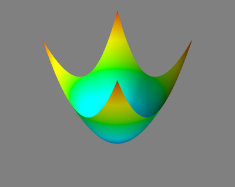

Potential ``conic``
^^^^^^^^^^^^^^^^^^^

* Formula: :math:`V(x) = \left[\begin{matrix}x & y\\y & - x\end{matrix}\right]`

* Variables: :math:`x`, :math:`y`

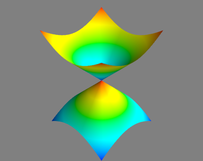

Potential ``conic_avoided``
^^^^^^^^^^^^^^^^^^^^^^^^^^^

* Formula: :math:`V(x) = \left[\begin{matrix}x & \sqrt{\delta^{2} + y^{2}}\\\sqrt{\delta^{2} + y^{2}} & - x\end{matrix}\right]`

* Variables: :math:`x`, :math:`y`

* Default values:

  * :math:`\delta = 1.0`

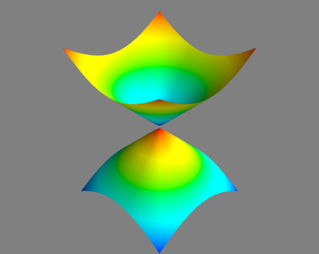

Potential ``conic_avoided_c``
^^^^^^^^^^^^^^^^^^^^^^^^^^^^^

* Formula: :math:`V(x) = \left[\begin{matrix}x & i \delta + y\\- i \delta + y & - x\end{matrix}\right]`

* Variables: :math:`x`, :math:`y`

Potential ``delta_gap_rotsym``
^^^^^^^^^^^^^^^^^^^^^^^^^^^^^^

* Formula: :math:`V(x) = \left[\begin{matrix}\frac{1}{2} \tanh{\left (\sqrt{x^{2} + y^{2}} \right )} & \delta\\\delta & - \frac{1}{2} \tanh{\left (\sqrt{x^{2} + y^{2}} \right )}\end{matrix}\right]`

* Variables: :math:`x`, :math:`y`

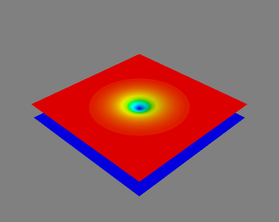

Potential ``quadratic_3d``
^^^^^^^^^^^^^^^^^^^^^^^^^^

* Formula: :math:`V(x) = \frac{sigmax x^{2}}{2} + \frac{sigmay y^{2}}{2} + \frac{sigmaz z^{2}}{2}`

* Variables: :math:`x`, :math:`y`, :math:`z`

* Default values:

  * :math:`sigmay = 1/2`
  * :math:`sigmax = 1/2`
  * :math:`sigmaz = 1/2`

